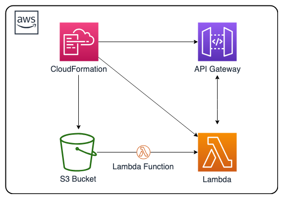

# serverless-cf-template
[](https://travis-ci.org/getcft/aws-serverless-cf-template)

AWS CloudFormation template creating a Serverless application using AWS Lambda and API Gateway

## Description

This <a href="https://aws.amazon.com/cloudformation/" target="_blank">AWS CloudFormation</a> solution deploys a simple <a href="https://aws.amazon.com/serverless/" target="_blank"> AWS serverless</a> example endpoint application. Serverless eliminates infrastructure management tasks such as server or cluster provisioning, patching, operating system maintenance, and capacity provisioning. This AWS CloudFormation template creates an <a href="https://aws.amazon.com/api-gateway/" target="_blank">AWS API Gateway</a> deployment for handling a RESTful request and <a href="https://aws.amazon.com/lambda/" target="_blank">AWS Lambda</a> function written in Python.

Serverless enables you to build modern applications with increased agility and lower total cost of ownership. Serverless allows you to build and run applications and services without thinking about servers. You can build them for nearly any type of application or backend service, and everything required to run and scale your application with high availability is handled for you.

Amazon API Gateway is a fully managed service that makes it easy for developers to create, publish, maintain, monitor, and secure APIs at any scale.

AWS Lambda lets you run code without provisioning or managing servers. You pay only for the compute time you consume - there is no charge when your code is not running.



AWS CloudFormation provides a common language for you to describe and provision all the infrastructure resources in your cloud environment.

## AWS Resource Costs

As with most AWS services you will incur costs for usage. For this CloudFormation template the resources that incur costs are as follows

* Pricing:
  * <a href="https://aws.amazon.com/s3/pricing/" target="_blank">S3 pricing</a>
  * <a href="https://aws.amazon.com/api-gateway/pricing/" target="_blank">API Gateway pricing</a>
  * <a href="https://aws.amazon.com/lambda/pricing/" target="_blank">Lambda pricing</a>

## Prerequisites

* <a href="https://aws.amazon.com" target="_blank"> Amazon Web Services Account</a>
* <a href="https://aws.amazon.com/iam/" target="_blank">IAM</a> User with the following permissions:
  * AWSCloudFormationReadOnlyAccess
  * AmazonAPIGatewayAdministrator
  * AWSLambdaFullAccess
  * AmazonS3FullAccess
* <a href="https://aws.amazon.com/iam/" target="_blank">IAM</a> Role named serverless (if you change the name make sure to change it in the template) with the following permissions:
  * AmazonAPIGatewayInvokeFullAccess
  * AWSLambdaExecute
  * AWSLambdaRole
  * Role Trust Relationship set to the below:
```json
{
  "Version": "2012-10-17",
  "Statement": [
    {
      "Effect": "Allow",
      "Principal": {
        "Service": [
          "apigateway.amazonaws.com",
          "lambda.amazonaws.com"
        ]
      },
      "Action": "sts:AssumeRole"
    }
  ]
}
```

## CloudFormation Template

* The CloudFormation Template is available on GitHub:
   * <a href="https://github.com/getcft/aws-serverless-cf-template" target="_blank">aws-serverless-cf-template</a>

* This CloudFormation states where the Lambda application exists, what it is named along with some configuration settings such as memory allocated, timeout for the application, runtime interpreter, and also creates an API Gateway endpoint with the proper handling of HTTP response codes in concert with the Lambda application.

* Things to change or note in the CloudFormation Template
  * Change your S3Bucket to the name of your bucket where you put the lambda.zip
  * If you made your own role name change the role name in two places from "role/serverless" to the role name you created

## AWS Lambda function in Python

* lambda.zip (located in the lambda-app folder in the repo)
  * This is a compressed zip file of lambda-app.py which is a simple function which when called outputs hard coded sample JSON. Lambda reads this zip file and uses the designated interpreter to execute it. In this example we are using Python as our language and the Python interpreter.
  * Make sure you upload it to the S3 bucket you are using and named in your CloudFormation template.


## Deploy the CloudFormation Template

* AWS Management Console

   * Login to *AWS Management Console*
   * Launch under *CloudFormation* your **edited** *serverless-cf-template.yml* (included in this repo)

* CloudFormation Fields:

   * *Stack name* (Enter a name to associate to your AWS Serverless deployment)
   * Continue choosing *Next* and then *Create* (it may take several mintues to create resources)

## Results of the CloudFormation Template

In the *AWS Management Console* you should be able to *verify* the following have been created.

* Resources Created:
   * An API Gateway Deployment
   * A Python Lambda Function
   * Test using the URL provided in the CloudFormation Outputs under TestURL in a browser, you should see the following JSON output:

```json
{"data": {"a": 1, "c": 3, "b": 2}}
```
